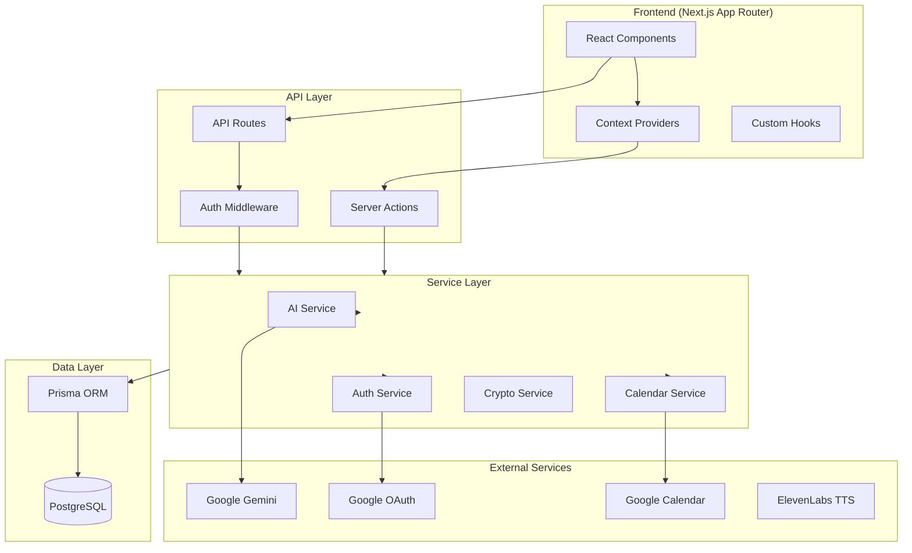
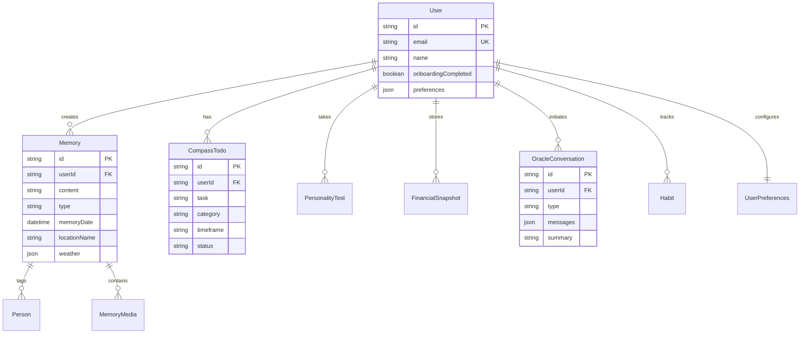

# 2moro - Personal Life Companion

<div align="center">


**A comprehensive personal life management platform powered by AI**

[](https://nextjs.org)
[](https://typescriptlang.org)
[](https://prisma.io)
[](https://tailwindcss.com)

</div>

---

## 📋 Table of Contents

- [Overview](#overview)
- [Features](#features)
- [Tech Stack](#tech-stack)
- [Architecture](#architecture)
- [Getting Started](#getting-started)
- [Project Structure](#project-structure)
- [API Reference](#api-reference)
- [Authentication & Security](#authentication--security)
- [AI Integration](#ai-integration)
- [Database Schema](#database-schema)
- [Testing](#testing)
- [Deployment](#deployment)
- [Environment Variables](#environment-variables)

---

## Overview

**2moro** is a full-stack personal life companion application that combines AI-powered insights with practical life management tools. It helps users track memories, manage personal growth, monitor financial wellness, and receive personalized guidance through an intelligent Oracle interface.

### 📖 The User Story
Imagine a professional navigating the complexities of modern life—balancing career ambitions, financial goals, personal relationships, and mental well-being. They use one app for tasks, another for journaling, a spreadsheet for finance, and various disconnected tools for self-improvement. **2moro** unifies these fragmented threads into a cohesive tapestry, acting as a proactive partner in their life's journey rather than just a passive repository of data.

### ❓ The Problem
We live in an era of information overload and tool fatigue.
- **Fragmentation**: Life data is scattered across incompatible platforms.
- **Analysis Paralysis**: We have data (steps, dollars, tasks) but lack actionable wisdom.
- **Short-termism**: Most tools focus on "today" (to-do lists) but neglect "tomorrow" (long-term vision and legacy).

### 💡 The Solution & Importance
2moro functions as a **"Life Operating System."** It doesn't just store data; it synthesizes it.
- **Unified Context**: Your financial health informs your life goals; your daily mood influences your journal prompts.
- **AI-Driven Wisdom**: The Oracle doesn't just chat; it remembers your history, understands your personality (MBTI), and offers tailored guidance.
- **Legacy Building**: Features like 'MyStory' and 'Archive' preserve your experiences, turning daily moments into a structured biography.

### 🎯 Usefulness
- **For Clarity**: Clears mental clutter by organizing tasks, finances, and thoughts in one place.
- **For Growth**: Provides objective, AI-analyzed feedback on your habits and trajectory.
- **For Peace of Mind**: Ensures no aspect of life (health, wealth, relationships) is neglected via holistic health scores.

### 👥 Target Audience
- **The Self-Optimizer**: Individuals interested in "Quantified Self" and continuous improvement.
- **The Busy Professional**: People who need a high-level cockpit for their complex lives.
- **The Introspective**: Those who value journaling, memory keeping, and legacy.

---

## Features

### 🏠 Dashboard
- Daily memory overview with rich media support
- Habit tracking with streak visualization
- Activity feed and calendar integration
- Quick memory capture

### 📝 Diary (Archive)
- Timeline-based memory browsing
- Location and weather metadata
- People tagging and relationships
- Multi-media support (text, images, video)

### 🧭 Compass
- **Personal Growth**: AI-generated recommendations based on MBTI personality type
- **Financial Wellness**: Health score calculation, investment projections
- **Action Plans**: Daily/weekly/monthly task management
- **Google Calendar Integration**: Sync tasks to external calendar

### 🔮 Oracle
- **Text Chat**: Conversational AI with context awareness
- **Voice Mode**: Real-time speech-to-speech interaction
- **Future Visualization**: AI-generated life path scenarios
- **Conversation History**: Persistent session management

### 📖 MyStory
- AI-generated biography chapters
- Audiobook narration via ElevenLabs
- Chronological life story compilation

### ⚙️ Settings
- Theme preferences (dark/light)
- Google Calendar OAuth connection
- Notification preferences
- Account management

---

## Tech Stack

### Frontend
| Technology | Version | Purpose |
|------------|---------|---------|
| **Next.js** | 16.1 | React framework with App Router |
| **React** | 19.2 | UI component library |
| **TypeScript** | 5.x | Type-safe JavaScript |
| **Tailwind CSS** | 4.x | Utility-first styling |
| **Framer Motion** | 12.x | Animations and transitions |
| **Three.js** | 0.182 | 3D graphics (Oracle orb) |
| **Lucide React** | 0.562 | Icon system |

### Backend
| Technology | Version | Purpose |
|------------|---------|---------|
| **Next.js API Routes** | 16.1 | Serverless API endpoints |
| **Prisma ORM** | 5.22 | Database access layer |
| **PostgreSQL** | 15+ | Primary database |
| **NextAuth.js** | 5.0-beta | Authentication |
| **Zod** | 4.x | Runtime validation |

### AI & External Services
| Service | Purpose |
|---------|---------|
| **Google Gemini** | Primary AI model (chat, recommendations, analysis) |
| **Google Gemini Live** | Real-time voice interactions |
| **ElevenLabs** | Text-to-speech for audiobooks |
| **Google Calendar API** | Task synchronization |
| **Google OAuth** | User authentication |

---

## Architecture



### Request Flow

1. **Client Request** → Browser sends request to Next.js
2. **Middleware** → `middleware.ts` validates authentication
3. **Route Handler** → API route or Server Action processes request
4. **Service Layer** → Business logic in `/lib` modules
5. **Data Layer** → Prisma ORM interacts with PostgreSQL
6. **External Services** → AI, OAuth, Calendar APIs called as needed

---

## Getting Started

### Prerequisites
- Node.js 20+
- PostgreSQL 15+
- Google Cloud Console project (for OAuth & Gemini)

### Installation

```bash
# Clone repository
git clone https://github.com/udujoel/2moro.git
cd 2moro

# Install dependencies
npm install

# Setup environment variables
cp .env.example .env.local
# Edit .env.local with your values

# Setup database
npx prisma migrate dev

# Start development server
npm run dev
```

### Available Scripts

| Script | Description |
|--------|-------------|
| `npm run dev` | Start development server (Turbopack) |
| `npm run build` | Create production build |
| `npm run start` | Start production server |
| `npm run lint` | Run ESLint |
| `npm test` | Run tests in watch mode |
| `npm run test:run` | Run tests once |
| `npm run test:coverage` | Run tests with coverage |

---

## Project Structure

```
2moro/
├── app/                          # Next.js App Router
│   ├── actions/                  # Server Actions
│   │   ├── compass.ts           # Compass feature actions
│   │   ├── dashboard.ts         # Dashboard data fetching
│   │   ├── habits.ts            # Habit tracking
│   │   ├── mystory.ts           # Biography generation
│   │   └── onboarding.ts        # User onboarding
│   ├── api/                      # API Routes
│   │   ├── auth/                # Authentication endpoints
│   │   ├── oracle/              # AI chat & voice endpoints
│   │   ├── speech/              # TTS token endpoint
│   │   └── suggestions/         # Daily suggestions
│   ├── archive/                  # Diary page
│   ├── compass/                  # Compass pages
│   ├── dashboard/                # Main dashboard
│   ├── login/                    # Authentication page
│   ├── mystory/                  # Biography viewer
│   ├── oracle/                   # Oracle chat interface
│   ├── settings/                 # User settings
│   └── simulation/               # Future visualization
│
├── components/                   # React Components
│   ├── archive/                  # Diary components
│   ├── auth/                     # Auth UI components
│   ├── compass/                  # Compass feature UI
│   ├── dashboard/                # Dashboard widgets
│   ├── mystory/                  # Biography components
│   ├── onboarding/               # Onboarding flows
│   ├── oracle/                   # Oracle UI (orb, chat)
│   ├── settings/                 # Settings panels
│   └── ui/                       # Shared UI primitives
│
├── lib/                          # Utility Libraries
│   ├── ai.ts                     # Gemini AI wrapper
│   ├── auth.ts                   # NextAuth configuration
│   ├── crypto.ts                 # Encryption utilities
│   ├── db.ts                     # Prisma client
│   ├── finance.ts                # Financial calculations
│   ├── google-calendar.ts        # Calendar integration
│   ├── logger.ts                 # Structured logging
│   ├── rate-limit.ts             # API rate limiting
│   ├── session.ts                # Session helpers
│   └── validations/              # Zod schemas
│
├── prisma/
│   └── schema.prisma             # Database schema
│
├── public/                       # Static assets
├── middleware.ts                 # Route protection
├── vitest.config.ts              # Test configuration
└── package.json
```

---

## API Reference

### Authentication Endpoints

| Endpoint | Method | Description |
|----------|--------|-------------|
| `/api/auth/[...nextauth]` | ALL | NextAuth.js handler |
| `/api/auth/user` | GET | Get current user |
| `/api/auth/clear-cookies` | POST | Clear auth cookies |
| `/api/auth/google/calendar` | GET | Initiate Calendar OAuth |
| `/api/auth/google/callback` | GET | Calendar OAuth callback |
| `/api/auth/google/disconnect` | POST | Revoke Calendar access |

### Oracle API Endpoints

| Endpoint | Method | Description |
|----------|--------|-------------|
| `/api/oracle/chat` | POST | Send chat message, receive AI response |
| `/api/oracle/voice` | POST | Voice transcription and response |
| `/api/oracle/live` | WS | Real-time voice streaming |
| `/api/oracle/speak` | POST | Text-to-speech generation |
| `/api/oracle/conversations` | GET | List conversation history |
| `/api/oracle/conversations/[id]` | GET/DELETE | Manage specific conversation |
| `/api/oracle/recent` | GET | Get recent conversation summary |
| `/api/oracle/future/generate` | POST | Generate future scenarios |
| `/api/oracle/future` | GET | Get existing visualization |
| `/api/oracle/future/image` | POST | Generate scenario images |

### Suggestions API

| Endpoint | Method | Description |
|----------|--------|-------------|
| `/api/suggestions/daily` | GET | Get daily memory prompts |
| `/api/suggestions/regenerate` | POST | Force new suggestions |

### Speech API

| Endpoint | Method | Description |
|----------|--------|-------------|
| `/api/speech/token` | GET | Get ElevenLabs session token |

---

## Authentication & Security

### Authentication Flow
1. User clicks "Sign in with Google" on `/login`
2. NextAuth.js redirects to Google OAuth
3. Upon success, JWT session token is created
4. Middleware validates token on protected routes

### Security Features

| Feature | Implementation |
|---------|----------------|
| **Session Management** | JWT-based sessions (30-day expiry) |
| **Route Protection** | `middleware.ts` guards protected pages |
| **Input Validation** | Zod schemas validate all inputs |
| **OAuth Token Encryption** | AES-256-GCM for stored tokens |
| **Rate Limiting** | Token bucket algorithm for AI endpoints |
| **HTTPS Only** | Secure cookies in production |
| **Environment Validation** | Startup checks for required env vars |

### Protected Routes
All routes except `/`, `/login`, and `/api/auth/*` require authentication.

---

## AI Integration

### Smart Router
The `lib/ai.ts` module provides a unified interface to Gemini models:

```typescript
// Model Selection
generateContentWithSmartRouter(prompt, mode)
// mode: "smart" | "pro" | "flash"
```

| Mode | Model | Use Case |
|------|-------|----------|
| `smart` | gemini-2.0-flash | Balanced speed/quality |
| `pro` | gemini-2.0-flash | Complex reasoning |
| `flash` | gemini-2.0-flash | Quick responses |

### AI Features

1. **Chat Oracle**: Contextual conversation with memory of past interactions
2. **Recommendations**: MBTI-based personal growth suggestions
3. **Financial Analysis**: AI-powered financial health insights
4. **Future Visualization**: Multi-scenario life path predictions
5. **Biography Generation**: Chronological life story from memories

---

## Database Schema

### Core Models



### Key Relationships
- **User** → Central entity, all features connect here
- **Memory** → Core content with people tagging and media
- **CompassTodo** → Task management with timeframes
- **OracleConversation** → Persistent chat history

---

## Testing

### Framework
- **Vitest**: Fast unit testing
- **Testing Library**: React component testing
- **jsdom**: Browser environment simulation

### Running Tests

```bash
# Watch mode
npm test

# Single run
npm run test:run

# With coverage
npm run test:coverage
```

### Test Coverage

| Module | Tests | Coverage |
|--------|-------|----------|
| `lib/utils.ts` | 6 | className merging |
| `lib/finance.ts` | 16 | Projections, scoring |

---

## Deployment

### Vercel (Recommended)

```bash
# Install Vercel CLI
npm i -g vercel

# Deploy
vercel --prod
```

### Environment Setup
1. Add all environment variables in Vercel dashboard
2. Connect PostgreSQL (Vercel Postgres or external)
3. Configure Google OAuth redirect URIs

See [DEPLOYMENT.md](./DEPLOYMENT.md) for detailed instructions.

---

## Environment Variables

### Required

```env
# Database
DATABASE_URL="postgresql://..."

# Authentication
NEXTAUTH_SECRET="your-secret-key"
NEXTAUTH_URL="http://localhost:3000"
GOOGLE_CLIENT_ID="..."
GOOGLE_CLIENT_SECRET="..."

# AI Services
GOOGLE_AI_API_KEY="..."

# Encryption
ENCRYPTION_KEY="32-byte-hex-key"
```

### Optional

```env
# ElevenLabs (for audiobooks)
ELEVENLABS_API_KEY="..."

# Development
NEXT_PUBLIC_API_URL="http://localhost:3000"
```

---

## Contributing

1. Fork the repository
2. Create a feature branch: `git checkout -b feature/my-feature`
3. Commit changes: `git commit -m 'Add my feature'`
4. Push to branch: `git push origin feature/my-feature`
5. Open a Pull Request

---

## License

This project is proprietary software. All rights reserved.

---

<div align="center">
Made with ❤️ by the 2moro Team
</div>
